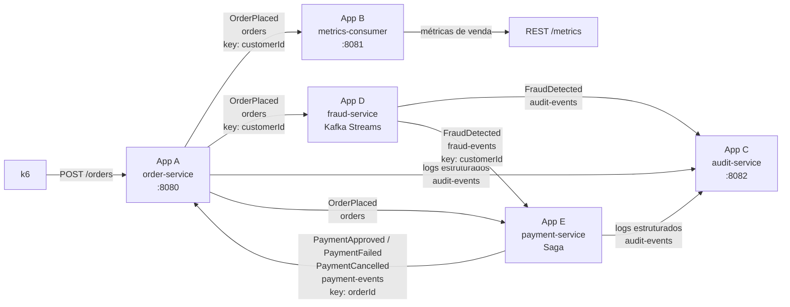
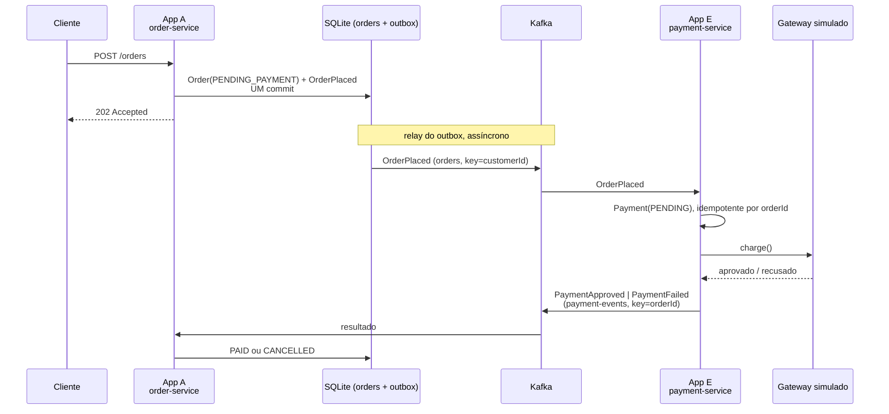
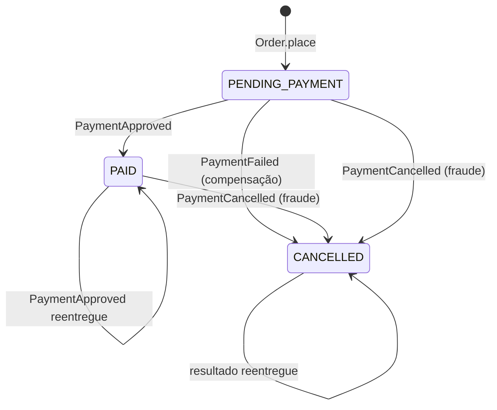
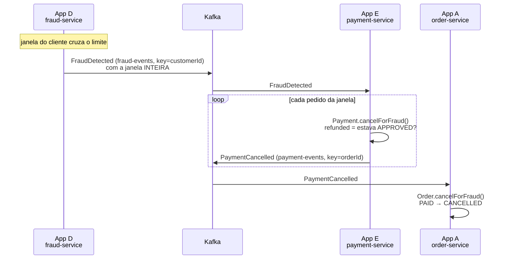
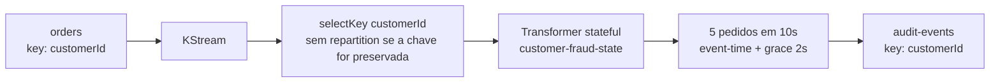
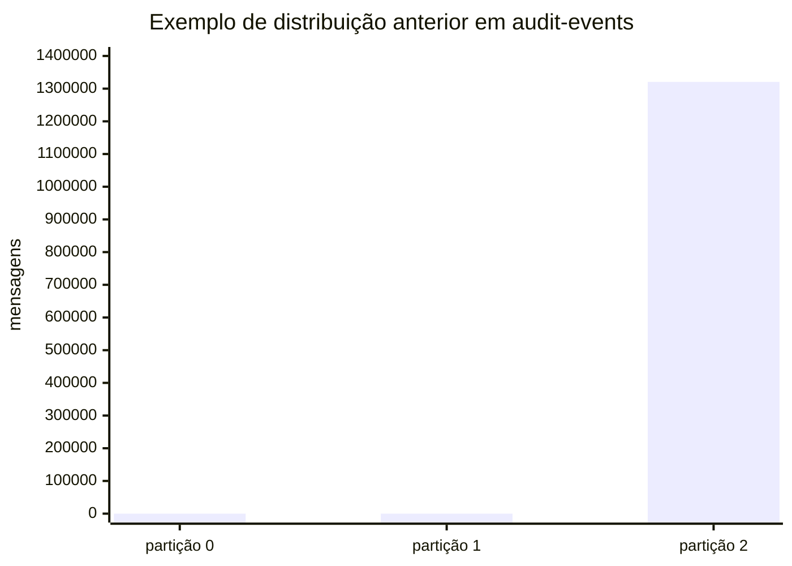

# training_kafka

Laboratório de Engenharia de Dados: cinco microsserviços Spring Boot ligados por Kafka,
modelados com **DDD tático** e **Ports & Adapters**, com carga gerada por k6.

O objetivo aqui não é o produto — é o desenho. A regra que governa tudo:

> **O domínio não sabe onde nem como os dados são persistidos.**
> Isso é decisão de wiring, tomada ao montar o sistema, nunca ao modelar o domínio.

E essa regra não depende de disciplina: os módulos `*-domain` declaram **zero** dependências,
então uma `@Service` escrita ali simplesmente não compila.

---

## O fluxo



## Os cinco serviços

| App | Módulo | Porta | O que faz |
|---|---|---|---|
| **A** | `order-service` | 8080 | Recebe pedidos por HTTP, valida no domínio, grava em SQLite, publica em `orders` via outbox e reage ao resultado do pagamento |
| **B** | `metrics-consumer` | 8081 | Consome `orders` e acumula métricas de venda |
| **C** | `audit-service` | 8082 | Consome `audit-events`, persiste e responde consultas por nível/app/período |
| **D** | `fraud-service` | — | Processa `orders` com Kafka Streams, alerta em `audit-events` e dispara compensação em `fraud-events` |
| **E** | `payment-service` | — | Consome `orders`, cobra num gateway simulado, publica o desfecho em `payment-events`, estorna ao receber `fraud-events` e registra tudo em `audit-events` |

## A Saga de pagamento

O pedido nasce em `PENDING_PAYMENT` e só sai desse estado quando o contexto de
Payment disser o que aconteceu. Não há chamada síncrona entre os dois, nem
transação distribuída, nem banco compartilhado: é uma **Saga coreografada**, onde
cada lado é dono do próprio estado e reage a fatos.



A compensação é o caminho de baixo: `PaymentFailed` leva o pedido de
`PENDING_PAYMENT` a `CANCELLED`. Quem executa é o **order-service**, porque o
pedido é dono do próprio ciclo de vida — o payment-service nunca escreve no estado
do pedido.



Transição contraditória — aprovar um pedido cancelado, cancelar um pago — levanta
`InvalidOrderTransitionException`, que é erro **permanente** e vai direto para a
DLQ. Reentrega do mesmo resultado é no-op. A diferença importa: engolir as duas
em silêncio faria a Saga terminar em estados que nenhuma sequência legítima de
eventos produz.

### Por que outbox

Gravar o pedido e publicar `OrderPlaced` são dois recursos diferentes. Feitos em
sequência, existe uma janela: processo morto no meio deixa um pedido
`PENDING_PAYMENT` que ninguém jamais pagaria — a Saga trava sem nenhum sinal.

O outbox fecha isso escrevendo o evento numa tabela do **mesmo** SQLite, no mesmo
commit do pedido. Um relay agendado drena a tabela para o Kafka, em ordem de
sequência, parando no primeiro erro. Broker fora do ar atrasa a entrega; não a
perde nem a embaralha.

O preço é **at-least-once**: morrer entre o ack do broker e a baixa da linha
reemite o evento. É por isso que o payment-service é idempotente por `orderId` —
duplicata não gera segunda cobrança. Exactly-once exigiria uma transação
englobando Kafka e SQLite, que não existe.

**O payment-service tem o mesmo outbox**, e pelo mesmo motivo. O desfecho da
cobrança e o `PaymentApproved`/`PaymentFailed`/`PaymentCancelled` correspondente
entram no SQLite dele num commit só; o relay entrega depois. Sem isso, um processo
morto entre gravar e publicar deixaria um pagamento resolvido cujo resultado
ninguém soube — e o pedido preso do outro lado, sem nada que o destravasse.

Com o outbox nos dois lados, a reentrega ficou mais simples: um `OrderPlaced`
repetido sobre um pagamento já resolvido apenas **retorna**. Não precisa reemitir
nada, porque se o pagamento está gravado o evento dele está na mesma transação —
ou já saiu, ou o relay ainda vai entregar.

A ordem importa mais deste lado: o relay para na primeira falha, e é isso que
impede um `PaymentCancelled` de ultrapassar o `PaymentApproved` do mesmo pedido.
Fora de ordem, o order-service veria um cancelamento de um pedido que para ele
ainda nem foi pago — e mandaria para a DLQ, corretamente.

### Compensação por fraude

A fraude é detectada **depois** do pagamento, e isso não é um defeito do desenho:
é a natureza do detector. [`CustomerFraudPattern`](fraud-service/fraud-service-domain/src/main/java/dev/joaolaureano/trainingkafka/fraud/domain/model/CustomerFraudPattern.java)
avalia uma **janela** — só dispara quando o cliente cruza `maxOrders` num
intervalo. O primeiro pedido de uma rajada é indistinguível de um pedido legítimo;
não existe veredito a dar sobre ele isoladamente. Fazer o pagamento esperar o
fraud seria esperar por eventos que ainda não aconteceram.

Então o fraud não bloqueia: ele **compensa**.



Quatro decisões que sustentam isso:

**Não é rollback.** Nada é desfeito — o pagamento commitou, o pedido foi pago.
`PaymentCancelled` é um movimento **novo**, no sentido inverso, e carrega
`refunded` para não mentir: se o pagamento ainda estava `PENDING`, nada saiu e
nada é estornado; se estava `APPROVED`, houve estorno de fato.

**A cadeia passa pelo Payment, não em paralelo.** O fraud não fala com o
order-service. O pedido continua mudando de estado só por evento do contexto que é
dono do dinheiro — uma fonte de verdade, e nenhuma corrida entre cancelar o pedido
e estornar a cobrança.

**`cancelForFraud()` é um método separado de `cancelForPaymentFailure()`.**
`PAID → CANCELLED` é a única saída de `PAID`, e é legítima *apenas* por fraude.
Um método único e permissivo apagaria a diferença entre isso e um resultado de
pagamento contraditório — que continua levantando `InvalidOrderTransitionException`.

**O evento carrega a janela inteira, não a amostra.** `FraudDetected` alimentava
só o alerta e cinco `orderId` bastavam para dar contexto a quem lesse o log.
Compensar metade de uma rajada deixaria pedidos fraudulentos pagos — pior do que
não compensar. O valor de cada pedido viaja junto porque o payment pode ainda não
ter visto o `OrderPlaced`: nesse caso ele registra o pagamento **já cancelado**, o
que fecha a porta para a cobrança que ainda está a caminho.

### A trilha de auditoria do pagamento

O App E registra em `audit-events` o que fez com o dinheiro, com o mesmo contrato
que o App A já usava — `level`, `timestamp`, `app`, `action`, `context`:

| Ação | Nível | Quando |
|---|---|---|
| `payment.approved` | INFO | O gateway aceitou a cobrança |
| `payment.declined` | WARN | O gateway recusou. **Não é erro**: é desfecho de negócio, e o sistema funcionou |
| `payment.refunded` | WARN | Compensação sobre pagamento aprovado — dinheiro voltou |
| `payment.cancelled` | WARN | Compensação sobre pagamento ainda pendente — nada foi cobrado |
| `payment.compensation.skipped` | INFO | Fraude detectada, mas não havia o que estornar |

Três decisões que valem o comentário:

**`declined` é WARN, não ERROR.** ERROR fica para quando o mecanismo falha — e aí a
exceção sobe, a mensagem vai para a DLQ e não passa pela trilha. Confundir os dois
faria um painel de erros acusar incidente toda vez que um cartão fosse recusado.

**`refunded` e `cancelled` são ações distintas**, e o contexto carrega
`previousStatus` e `refunded`. Chamar de "estorno" um pagamento que nunca foi
cobrado é mentira contábil, e conciliar depois exige saber qual dos dois foi.

**`compensation.skipped` existe porque o silêncio não explica.** Para quem audita,
"por que este pedido fraudulento não foi estornado?" é pergunta legítima; sem esse
registro, a resposta — o pagamento já havia falhado — não está em lugar nenhum.

O `customerId` **não** vai para o log, seguindo o que o App A já fazia. O
`correlationId` vai, e é ele que costura a linha do pedido, a do pagamento e a do
alerta de fraude numa investigação.

> Isto **não** passa pelo outbox, e a diferença é deliberada. O registro contábil é a
> tabela `payments` mais o `payment-events`, e esses são transacionais. `audit-events`
> é a visão pesquisável desses fatos: perder uma linha num crash é aceitável, e
> amarrá-la à transação do pagamento faria telemetria atrasar dinheiro.

### O que o fraud-service continua não fazendo

Ele não **autoriza**. Não há chamada síncrona do payment para o fraud, e o gateway
do App E tem regra própria e determinística (um limite de valor), documentada como
simulação. O fraud age depois, por evento, ou não age.

### Fraud com Kafka Streams

O detector de fraude foi separado do `metrics-consumer` porque sua unidade de
consistência é o cliente, enquanto as métricas de produto têm outra chave natural.
Um consumer tradicional exigia leitura, poda e gravação JDBC da janela a cada
pedido. Kafka Streams fornece essa combinação como uma topology stateful, com
state store local, changelog Kafka e recuperação automática após restart.



O `KStream` representa cada pedido. O `customer-fraud-state` é um
`KeyValueStore` persistente por `customerId`; guarda pedidos recentes, IDs já
vistos para deduplicação e o maior `occurredAt` observado. O changelog interno
permite reconstruir o estado sem banco externo. A regra emite um alerta somente
na transição normal para suspeito.

`occurredAt` é extraído como event-time. O transformer aceita eventos até 2 segundos
atrás do maior timestamp já visto para o cliente; eventos mais antigos são ignorados
para não reabrir estado indefinidamente. Essa é uma política de atraso implementada
no stateful transformer, não uma janela DSL nativa do Kafka Streams. A ordem só é
garantida dentro da partição.
Como `orders` é publicado com `customerId` e três partições, todos os eventos de
um cliente chegam à mesma task. O serviço pode escalar até o número de partições,
distribuindo tasks entre stream threads e instâncias; aumentar threads além das
partições não cria paralelismo adicional.

O serviço usa `application.id=fraud-service` e `processing.guarantee=exactly_once_v2`.
Offsets, state store e publicação Kafka são coordenados transacionalmente. Isso
protege os efeitos Kafka durante replay/restart, mas não torna efeitos externos
idempotentes. Os alertas usam `customerId` como chave e carregam os IDs dos pedidos
na amostra, enquanto o `audit-service` continua consumindo o contrato existente.

| Tópico | Key | Value | Partições | Producer | Consumer |
|---|---|---|---:|---|---|
| `orders` | `customerId` | `OrderPlacedMessage` | 3 | `order-service` | `metrics-consumer`, `fraud-service` |
| `audit-events` | `applicationName` pelo `order-service`; `customerId` pelo `fraud-service` | `AuditEventMessage` | 3 | `order-service`, `fraud-service` | `audit-service` |

O broker mantém auto-criação desligada. `orders` e `audit-events` são criados
pelos serviços existentes; o state store não é um tópico de negócio e seu
changelog é gerenciado pelo Kafka Streams.

Para executar apenas o detector:

```bash
java -jar fraud-service/fraud-service-bootstrap/target/fraud-service-bootstrap-0.1.0-SNAPSHOT.jar
java -jar payment-service/payment-service-bootstrap/target/payment-service-bootstrap-0.1.0-SNAPSHOT.jar
```

Testes de domínio e topology usam JUnit e `TopologyTestDriver`, cobrindo threshold,
deduplicação, poda da janela e eventos além do grace period:

```bash
mvn -pl fraud-service/fraud-service-bootstrap -am test
```

---

## Pré-requisitos

```bash
brew install openjdk@21 maven
brew install colima docker docker-compose
brew install k6 node          # só para os testes de carga
```

`openjdk@21` é *keg-only*: o Homebrew não coloca o `java` no PATH. Ou você resolve de vez —

```bash
echo 'export PATH="/opt/homebrew/opt/openjdk@21/bin:$PATH"' >> ~/.zshrc
```

— ou usa o caminho completo (`/opt/homebrew/opt/openjdk@21/bin/java`) nos comandos abaixo.

O plugin do Compose precisa ser registrado uma vez em `~/.docker/config.json`:

```json
{ "cliPluginsExtraDirs": ["/opt/homebrew/lib/docker/cli-plugins"] }
```

---

## Subindo tudo

### 1. Infraestrutura

```bash
colima start --cpus 4 --memory 8 --disk 40
docker compose up -d
```

Kafka em modo KRaft (sem ZooKeeper) e Kafka UI em **http://localhost:8090**.

O broker anuncia dois listeners: `kafka:9092` para a rede do Compose e `localhost:9094`
para processos no macOS. É o detalhe que mais quebra Kafka em Docker — um listener só
não consegue anunciar um endereço válido para os dois lados ao mesmo tempo.

A auto-criação de tópicos está **desligada** de propósito: assim um nome errado falha alto,
em vez de criar silenciosamente um tópico fantasma com 1 partição. Os tópicos são declarados
pelo App A no boot, com 3 partições cada — `orders`, `audit-events` e
`payment-events` e `fraud-events`. Os tópicos de dead letter (`<tópico>-dlt`) são
criados por quem consome.

### 2. Build

```bash
mvn clean install
```

### 3. Os cinco serviços

Cada um numa aba de terminal:

```bash
java -jar order-service/order-service-bootstrap/target/order-service-bootstrap-0.1.0-SNAPSHOT.jar
java -jar metrics-consumer/metrics-consumer-bootstrap/target/metrics-consumer-bootstrap-0.1.0-SNAPSHOT.jar
java -jar audit-service/audit-service-bootstrap/target/audit-service-bootstrap-0.1.0-SNAPSHOT.jar
java -jar fraud-service/fraud-service-bootstrap/target/fraud-service-bootstrap-0.1.0-SNAPSHOT.jar
java -jar payment-service/payment-service-bootstrap/target/payment-service-bootstrap-0.1.0-SNAPSHOT.jar
```

### 4. Um pedido

```bash
curl -X POST localhost:8080/orders \
  -H 'Content-Type: application/json' \
  -d '{"customerId":"cust-1","product":"Teclado","quantity":2,"amount":199.90}'
```

```bash
curl -s "localhost:8081/metrics/top-products?limit=5"
curl -s "localhost:8082/audit-events?level=WARN&limit=10"
```

---

## Trocando a persistência

É aqui que o desenho se prova. Os mesmos serviços, com implementações de repositório
completamente diferentes, **sem tocar numa linha de domínio**:

```bash
# App B
java -jar .../metrics-consumer-bootstrap-0.1.0-SNAPSHOT.jar --spring.profiles.active=inmemory   # default
java -jar .../metrics-consumer-bootstrap-0.1.0-SNAPSHOT.jar --spring.profiles.active=sqlite
java -jar .../metrics-consumer-bootstrap-0.1.0-SNAPSHOT.jar --spring.profiles.active=duckdb

# App C
java -jar .../audit-service-bootstrap-0.1.0-SNAPSHOT.jar --spring.profiles.active=stdout       # default
java -jar .../audit-service-bootstrap-0.1.0-SNAPSHOT.jar --spring.profiles.active=jsonl
java -jar .../audit-service-bootstrap-0.1.0-SNAPSHOT.jar --spring.profiles.active=duckdb
```

| App | Profile | Onde os dados param | Arquivo |
|---|---|---|---|
| B | `inmemory` | memória (somem ao reiniciar) | — |
| B | `sqlite` | SQLite | `data/metrics.db` |
| B | `duckdb` | DuckDB | `data/metrics.duckdb` |
| C | `stdout` | console — **não armazena** | — |
| C | `jsonl` | uma linha JSON por registro | `data/audit.jsonl` |
| C | `duckdb` | DuckDB, tabela `audit_events` | `data/audit.duckdb` |

> **O adapter `stdout` não armazena nada**, então `GET /audit-events` sempre devolve lista vazia.
> Isso é uma limitação declarada no javadoc do Port e fixada por um teste — uma lista vazia
> que significa "não há onde procurar" é diferente de uma que significa "nada casou".

> **DuckDB aceita um único processo escritor por arquivo.** Por isso o App C usa
> `data/audit.duckdb`, separado do App B. Apontar os dois para o mesmo arquivo com ambos
> no ar falha assim:
> ```
> IO Error: Could not set lock on file ".../data/metrics.duckdb":
> Conflicting lock is held in .../java (PID 61193)
> ```

---

## Testes de carga


O k6 mede duas coisas diferentes, e a segunda só passou a existir com a Saga.

A primeira é a de sempre: latência e taxa de aceitação do `POST /orders`. A segunda é a
**convergência** — uma amostra dos pedidos é consultada em `GET /orders/{id}` até chegar a
um estado terminal. Isso importa porque `202` significa muito menos do que significava: o
pedido nasce em `PENDING_PAYMENT` e tudo que interessa acontece depois. Um `p(95)` verde com
o relay do outbox travado seria um teste passando sobre um sistema quebrado — e é
exatamente o que os thresholds `saga_settled` e `fraud_compensations_observed` recusam a
deixar passar.

O cenário `fraud_compensation_check` é separado do `suspicious_burst` de propósito. Esperar
o estorno bloquearia o VU por dezenas de segundos e mataria a rajada que ele existe para
produzir; num cenário próprio, um cliente dedicado com janela limpa permite acompanhar o
ciclo inteiro — `PENDING_PAYMENT`, `PAID`, `CANCELLED` — e provar que a compensação desfaz
um pagamento que de fato aconteceu.

> **Mais da metade dos pedidos do cenário normal é recusada pelo gateway, e isso está
> certo.** O catálogo vai de 15 a 900 e a quantidade de 1 a 5, então ~52% passa de
> `payment.gateway.approval-limit` (1000) e termina `CANCELLED` por `PaymentFailed`. Por
> isso o teste exige que o pedido chegue a um estado *terminal*, não que chegue a `PAID`:
> exigir `PAID` reprovaria o teste por metade dos pedidos estarem se comportando exatamente
> como deveriam. Para ver mais aprovações, suba `PAYMENT_APPROVAL_LIMIT`.

### Rodando

```bash
cd load-tests
npm install
./run.sh                     # sobe tudo, roda a carga completa, desmonta
./run.sh --smoke             # passagem curta (~40s), para validar a montagem
```

O `run.sh` faz a sequência inteira: Kafka pelo compose, `mvn install`, os cinco serviços em
background, espera cada um ficar pronto, roda o k6 e desmonta no final — inclusive em
Ctrl-C ou erro, porque um serviço órfão segurando a `:8080` faz a execução seguinte falhar
por um motivo que não tem nada a ver com o teste.

O script existe porque a Saga transformou isto num teste de **integração**. Não dá mais para
medir só o POST: verificar convergência e compensação exige os cinco serviços e o broker no
ar ao mesmo tempo, e essa montagem na mão é longa o bastante para alguém errar — e errar de
um jeito que parece falha do sistema.

Duas esperas nele não são paranoia:

- **Prontidão por serviço.** App A, B e C respondem em `/actuator/health`; App D e E não têm
  porta HTTP, então a prova de vida é a linha de boot do Spring no log.
- **Rebalance do Kafka Streams.** Entre o `fraud-service` "subir" e a topology estar
  consumindo existe o rebalance. Começar a carga antes disso faria a rajada inicial passar
  sem ser vista, e o teste cobraria uma compensação que nunca teve chance de acontecer.

Se preferir controlar a stack por fora, `--no-infra` e `--skip-build` pulam o compose e o
build; `--keep` deixa tudo no ar para você inspecionar. Os logs de cada serviço ficam em
`load-tests/logs/`.

Rodando o k6 sozinho, sem o script:

```bash
npm test                     # build + rampa completa
PROFILE=smoke npm test       # perfil curto
```

O runtime do k6 não é Node e não resolve `node_modules`, então o script passa por um
bundle com esbuild antes de rodar — é o que permite usar `@faker-js/faker`.

### Os cenários

- **`normal_traffic`** — rampa `10 → 100 → 500` VUs, cada requisição com cliente próprio.
  Não deve acionar detecção nenhuma. Uma amostra (`VERIFY_SAMPLE_RATE`, 2% por padrão) tem o
  desfecho verificado; verificar todos transformaria o teste de carga num teste de polling.
- **`suspicious_burst`** — 5 VUs martelando um pool fixo de 5 clientes, sem pausa, para
  acionar a janela do `fraud-service` de forma determinística e não por acidente estatístico.
- **`fraud_compensation_check`** — um VU com cliente dedicado por iteração, acompanhando o
  ciclo completo até o estorno.

> A rajada de 3 minutos produz **poucos** estornos, não milhares — e isso é correto.
> `CustomerFraudPattern.register()` só emite na transição de "não fraudulento" para
> "fraudulento"; um cliente já sinalizado que segue comprando não gera evento novo. É por
> isso que a verificação da compensação precisa de um cliente novo a cada iteração.

Depois da carga, o efeito é visível nas duas pontas:

```bash
curl -s "localhost:8081/metrics/top-products?limit=5"
curl -s "localhost:8082/audit-events?level=WARN&app=fraud-service&limit=10"
```

### O que a carga revelou

Rodando a rampa completa numa máquina com 4 CPUs (Colima), com App B em DuckDB:

| | |
|---|---|
| Pedidos aceitos em 3 min | **2.342.364** |
| Rejeitados | 0 |
| Latência p(95) / p(99) | 47 ms / — |
| Throughput do App A | ~13.000 pedidos/s |

O App A aguenta. **Os consumidores não**, e por dois motivos que valem mais que o
teste em si:

**1. Escrita por mensagem, com commit por mensagem.** Medindo a taxa de drenagem do
mesmo backlog, só trocando o profile:

| Profile | Throughput |
|---|---|
| `inmemory` | ~3.150 msg/s |
| `duckdb` | ~383 msg/s |
| `sqlite` | ~283 msg/s |

Os dois bancos ficam ~10× abaixo da memória, e SQLite fica *abaixo* do DuckDB — ou seja,
não é uma questão de OLAP versus OLTP. Cada mensagem dispara ~6 idas ao banco
(`append` no ledger, `findOrCreate` + `save` de duas raízes de agregado), cada uma com
commit próprio e portanto `fsync`. O gargalo é a quantidade de commits, não o motor.

O caminho para melhorar é consumo em lote: acumular N mensagens, processar e commitar
uma vez só. Isso muda o adapter, não o domínio — o que é justamente o ponto.

**2. Distribuição desigual de partição no tópico `audit-events`.** Depois da carga:



A chave dos logs do `order-service` é o **nome do app**, então todos os logs desse serviço
têm a mesma chave e caem sempre na mesma partição. As outras duas ficam ociosas, e o
paralelismo do App C fica preso em 1 consumidor por app — por mais que se aumente
`concurrency`. Os alertas do `fraud-service` usam `customerId`, conforme documentado na
tabela de contratos acima.

Foi uma escolha ruim de chave da minha parte: ela preserva a ordem cronológica dos logs
de cada serviço, mas o custo é desproporcional. Para logs, a ordem global por app raramente
importa; deixar a chave nula (distribuição round-robin) devolveria as três partições ao jogo.
Ficou registrado aqui em vez de silenciosamente corrigido, porque o erro é mais instrutivo
que o acerto.

---

## A arquitetura

### Por que módulos Maven separados

Cada serviço são quatro módulos, e a dependência só aponta para dentro:

| Módulo | Depende de | Dependências externas |
|---|---|---|
| `*-domain` | **nada** | só JUnit e AssertJ, em escopo de teste |
| `*-application` | `*-domain` | nenhuma |
| `*-adapters` | `*-domain` | Spring, Kafka, Jackson, drivers JDBC |
| `*-bootstrap` | os três acima | Spring Boot (é onde o `main` mora) |

Convenção não segura isso; o compilador sim. Além disso, o `maven-enforcer-plugin` barra
dependências de infraestrutura nos módulos de domínio com mensagem explicativa — inclusive
as transitivas — e barra a dependência `*-adapters → *-application` no módulo de adapters.

### Por que o módulo `*-bootstrap`

Repare na tabela: **o adapter não depende da camada de aplicação**. Isso é deliberado, e é
o que o módulo `*-bootstrap` existe para permitir.

Um adapter de entrada precisa que alguém execute o caso de uso — mas não precisa saber
quem. Então ele declara, no próprio pacote, a interface de que precisa:
`PlaceOrderPort`, `AuditQueryPort`, `OrderPlacedPort`. Do outro lado, a camada de aplicação
oferece o que sabe fazer. Nenhum dos dois módulos importa o outro; quem costura os dois
lados é uma **facade** no `*-bootstrap` — o único módulo que enxerga tudo, porque enxergar
tudo é exatamente o trabalho dele.

O mesmo vale para o lado de saída: `KafkaActivityLogPublisher` publica logs com uma
assinatura em tipos crus e não implementa `ActivityLogPublisher`; a facade
`ActivityLogFacade`, no bootstrap, é que implementa o Port da aplicação e delega.

O que mora no `*-bootstrap`: a classe `main`, o `application.yml`, o `*Wiring` (quem
implementa cada Port), a escolha de persistência por profile e as facades. O que fica no
`*-adapters`: só tecnologia — controllers, listeners, repositórios, e a configuração
técnica que não escolhe implementação nenhuma (criação de tópicos, error handler da DLQ).

O POM raiz **não herda** de `spring-boot-starter-parent`, só importa o BOM de versões:
herdar traria o plugin do Spring para todos os módulos, inclusive os de domínio. O preço
dessa escolha é ter que declarar à mão coisas que o parent daria de graça — como
`maven.compiler.parameters`, sem a qual todo `@RequestParam` falha em runtime.

### O modelo de domínio do App B

Duas raízes de agregado, porque são duas fronteiras de consistência distintas:

- **`ProductSalesRecord`** (id: `ProductId`) — unidades e faturamento sempre mudam juntos.
  Garantido pela forma da classe: existe um único mutador, e ele move os três campos numa
  operação só.
- **`OrderRecord`** — ledger append-only, imutável. É o que torna possível responder
  faturamento de **qualquer** período; `ProductSalesRecord` acumula totais sem dimensão
  temporal, e deve continuar assim.

E **`RevenueWindow`**, value object derivado por agregação sobre o ledger — nunca armazenado,
para não criar uma segunda verdade sobre o mesmo fato.

O `OrderPlacedHandler` que costura tudo isso **não tem um único `if` de negócio**. Esse é o
critério de qualidade do modelo: se uma regra precisar aparecer ali, é porque vazou de um
agregado, e o conserto é movê-la de volta — não escrever o `if`.

### Por que os contratos de evento são duplicados

Cada serviço tem sua **própria** classe para o JSON que trafega no tópico. Compartilhar uma
classe entre eles os colaria pelo classpath: uma refatoração interna no App A quebraria a
compilação do App B. O preço são seis nomes de campo repetidos; o retorno é que os bounded
contexts evoluem sozinhos, com a tradução acontecendo numa Anticorruption Layer explícita
(`OrderPlacedTranslator`, `AuditEventTranslator`).

Na mesma linha, `spring.json.add.type.headers=false`: com o header de tipo, o consumidor
precisaria conhecer o nome completo da classe do produtor para desserializar.

### Dinheiro

`Money` é um value object com duas casas decimais, e no banco vira **centavos inteiros**.
SQLite não tem tipo decimal de verdade (guardaria como `REAL`, com erro de ponto flutuante)
e `TEXT` não permitiria `SUM()` nas consultas de faturamento. Um `BIGINT` de centavos é
exato, somável, e se comporta igual nos dois bancos.

### Concorrência

`spring.kafka.listener.concurrency: 1` no App B, de propósito. `ProductSalesRecord` não é
seguro para escritas concorrentes: o mesmo produto aparece em pedidos de clientes diferentes,
logo em partições diferentes, e dois ciclos `findOrCreate → registerSale → save` concorrentes
perderiam uma venda. A detecção por cliente não está mais neste consumer: ela usa as tasks e
state stores do `fraud-service`.

Aumentar esse número exige antes introduzir controle de versão otimista nos repositórios.
Ficou como exercício explícito, não como esquecimento.

---

## Testes

```bash
mvn test
```

108 testes. Os mais interessantes são os **de contrato**: a mesma bateria, escrita puramente
em vocabulário de domínio, roda contra todas as implementações de cada Port —
`{ProductSales, OrderLedger} × {inMemory, SQLite, DuckDB}` no App B e
`AuditRepository × {JSONL, DuckDB}` no App C.

Se algum desses testes precisasse de um `if (isSqlite)`, seria a prova de que o Port foi
moldado por acidente em torno de uma tecnologia. Nenhum precisou.

Os testes de domínio não sobem contexto Spring nem usam mock framework: rodam em
milissegundos, com fakes de cinco linhas. Isso só é possível porque o domínio não depende de
nada — é o retorno prático de tê-lo isolado.

---

## Estrutura

```mermaid
flowchart TD
  Root[training_kafka]
  Root --> Infra[docker-compose.yml<br/>Kafka KRaft + Kafka UI]
  Root --> Build[pom.xml<br/>POM raiz]
  Root --> Data[data/<br/>arquivos de runtime]
  Root --> Order[order-service<br/>App A]
  Order --> OrderDomain[order-service-domain<br/>domínio]
  Order --> OrderApplication[order-service-application<br/>PlaceOrderService + Saga]
  Order --> OrderAdapters[order-service-adapters<br/>REST + Kafka + outbox]
  Order --> OrderBootstrap[order-service-bootstrap<br/>main + wiring]
  Root --> Metrics[metrics-consumer<br/>App B]
  Metrics --> MetricsDomain[metrics-consumer-domain<br/>2 agregados + 2 Ports]
  Metrics --> MetricsApplication[metrics-consumer-application<br/>handler + queries]
  Metrics --> MetricsAdapters[metrics-consumer-adapters<br/>Kafka + REST + repositories]
  Metrics --> MetricsBootstrap[metrics-consumer-bootstrap<br/>main + wiring]
  Root --> Audit[audit-service<br/>App C]
  Audit --> AuditDomain[audit-service-domain<br/>AuditEvent + filtros]
  Audit --> AuditApplication[audit-service-application<br/>ingestão + queries]
  Audit --> AuditAdapters[audit-service-adapters<br/>Kafka + REST + persistência]
  Audit --> AuditBootstrap[audit-service-bootstrap<br/>main + wiring]
  Root --> Fraud[fraud-service<br/>App D]
  Fraud --> FraudDomain[fraud-service-domain<br/>CustomerFraudPattern]
  Fraud --> FraudApplication[fraud-service-application<br/>FraudDetectionService]
  Fraud --> FraudAdapters[fraud-service-adapters<br/>contratos + state store]
  Fraud --> FraudBootstrap[fraud-service-bootstrap<br/>main + topology]
  Root --> Payment[payment-service<br/>App E]
  Payment --> PaymentDomain[payment-service-domain<br/>Payment + eventos]
  Payment --> PaymentApplication[payment-service-application<br/>ProcessOrderPayment]
  Payment --> PaymentAdapters[payment-service-adapters<br/>Kafka + gateway + SQLite]
  Payment --> PaymentBootstrap[payment-service-bootstrap<br/>main + wiring]
  Root --> Load[load-tests<br/>k6 + faker + esbuild]
```



## Endpoints

| Método | Endpoint | Descrição |
|---|---|---|
| `POST` | `:8080/orders` | Registra um pedido. `202` se aceito, `400` com a lista completa de violações se não |
| `GET` | `:8080/orders/{id}` | Estado corrente do pedido: `PENDING_PAYMENT`, `PAID` ou `CANCELLED`. `404` se desconhecido |
| `GET` | `:8081/metrics/top-products?limit=10` | Produtos mais vendidos |
| `GET` | `:8081/metrics/revenue?hours=24&product=X` | Faturamento e ticket médio no período |
| `GET` | `:8082/audit-events?level=WARN&app=X&limit=50` | Auditoria por severidade mínima, app e período |
| `GET` | `:808{0,1,2}/actuator/health` | Saúde de cada serviço |

`POST /orders` responde **202 Accepted**, e não 201: o pedido foi publicado no tópico, mas a
agregação do App B acontece de forma assíncrona. Prometer "Created" seria mentir sobre o que
já terminou.

`GET /orders/{id}` existe porque o 202 passou a prometer menos ainda depois da Saga: o pedido
nasce em `PENDING_PAYMENT` e o desfecho chega por evento. Sem uma leitura, o resultado da
compensação não seria observável de fora — nem por um humano, nem pelo teste de carga. Um id
malformado responde `404`, e não `500`: perguntar por `abc` é perguntar por um pedido que não
pode existir, o que é o mesmo caso de um id válido e desconhecido.

O filtro `level` é por severidade **mínima** — pedir `WARN` traz `WARN` e `ERROR`. É o que
alguém investigando um incidente espera, e evita ter que consultar duas vezes.
