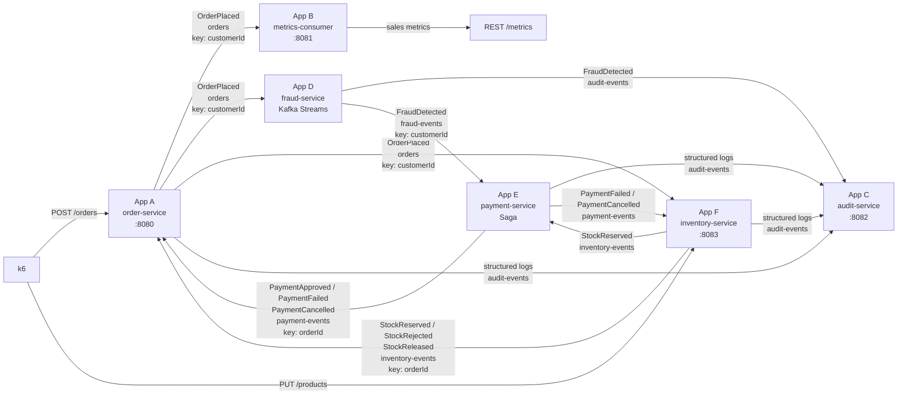
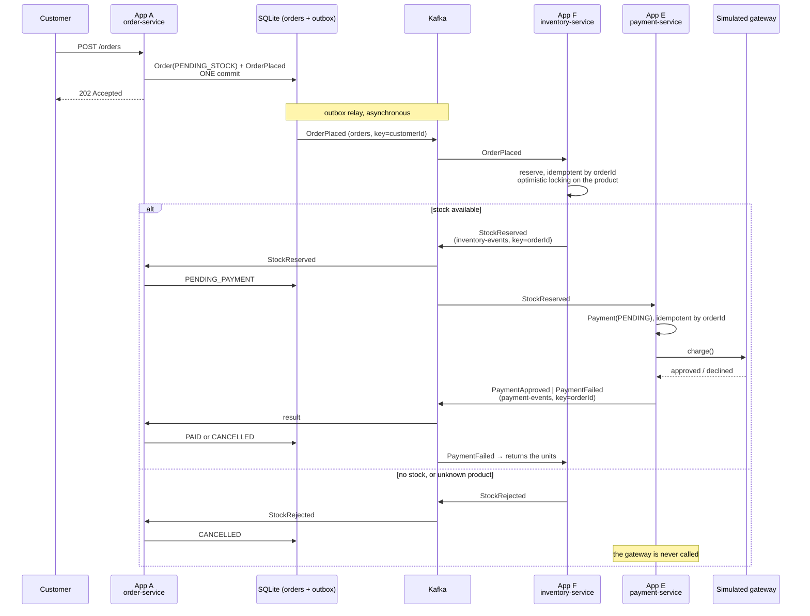
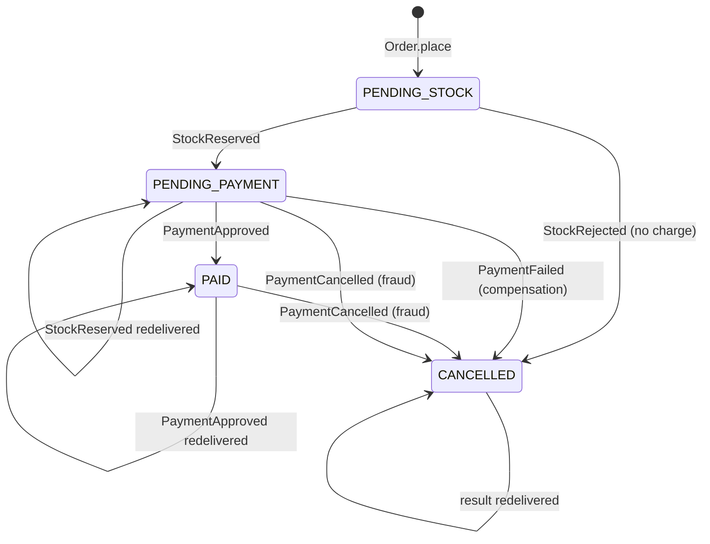
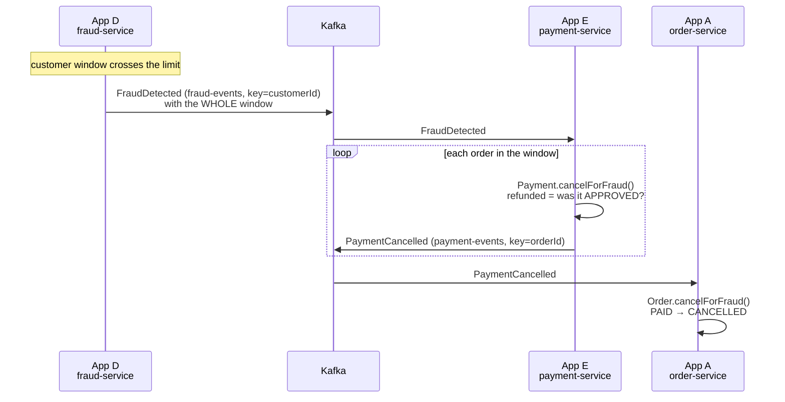
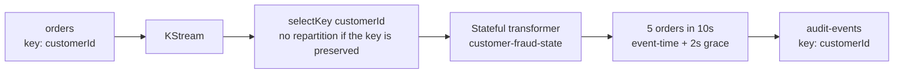
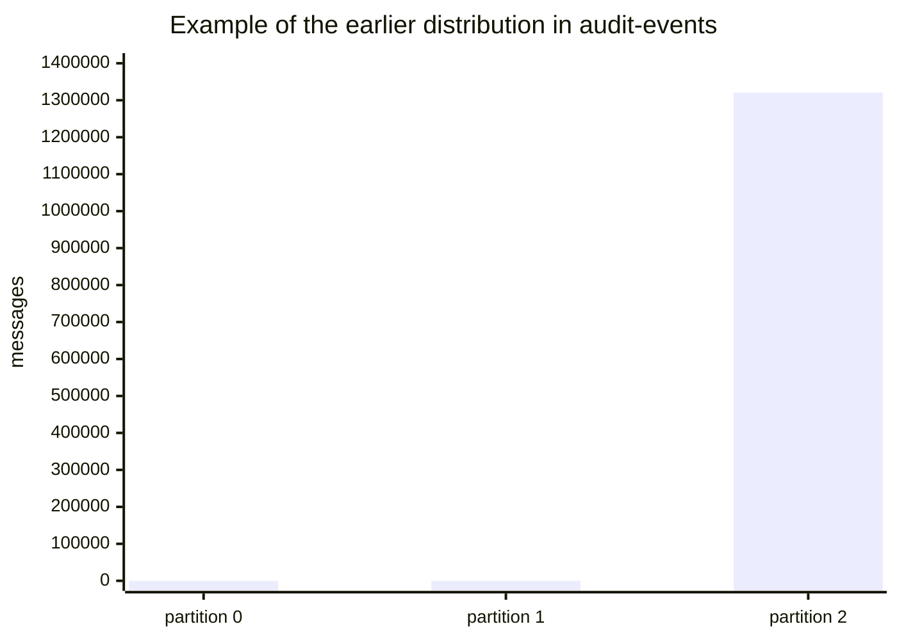

# training_kafka

**[Leia em português / Read this in Portuguese](README.pt-BR.md)**

Data Engineering lab: six Spring Boot microservices connected by Kafka, modelled with
**tactical DDD** and **Ports & Adapters**, with load generated by k6.

The goal here isn't the product — it's the design. The rule that governs everything:

> **The domain doesn't know where or how data is persisted.**
> That's a wiring decision, made when assembling the system, never when modelling the domain.

And this rule doesn't depend on discipline: the `*-domain` modules declare **zero**
dependencies, so a `@Service` written there simply doesn't compile.

---

## The flow


```mermaid
flowchart LR
    K6[k6] -->|POST /orders| Order[App A<br/>order-service<br/>:8080]
    K6 -->|PUT /products| Inventory[App F<br/>inventory-service<br/>:8083]
    Order -->|OrderPlaced<br/>orders<br/>key: customerId| Metrics[App B<br/>metrics-consumer<br/>:8081]
    Order -->|OrderPlaced<br/>orders<br/>key: customerId| Fraud[App D<br/>fraud-service<br/>Kafka Streams]
    Order -->|OrderPlaced<br/>orders<br/>key: customerId| Inventory
    Metrics -->|sales metrics| MetricsApi[REST /metrics]
    Fraud -->|FraudDetected<br/>audit-events| Audit[App C<br/>audit-service<br/>:8082]
    Order -->|structured logs<br/>audit-events| Audit
    Payment -->|structured logs<br/>audit-events| Audit
    Inventory -->|structured logs<br/>audit-events| Audit
    Inventory -->|StockReserved / StockRejected<br/>StockReleased<br/>inventory-events<br/>key: orderId| Order
    Inventory -->|StockReserved<br/>inventory-events| Payment[App E<br/>payment-service<br/>Saga]
    Payment -->|PaymentApproved / PaymentFailed<br/>PaymentCancelled<br/>payment-events<br/>key: orderId| Order
    Payment -->|PaymentFailed / PaymentCancelled<br/>payment-events| Inventory
    Fraud -->|FraudDetected<br/>fraud-events<br/>key: customerId| Payment
```

## The six services

| App | Module | Port | What it does |
|---|---|---|---|
| **A** | `order-service` | 8080 | Receives orders over HTTP, validates them in the domain, stores them in SQLite, publishes to `orders` via outbox and reacts to the stock verdict and the payment result |
| **B** | `metrics-consumer` | 8081 | Consumes `orders` and accumulates sales metrics |
| **C** | `audit-service` | 8082 | Consumes `audit-events`, persists them and answers queries by level/app/period |
| **D** | `fraud-service` | — | Processes `orders` with Kafka Streams, alerts on `audit-events` and triggers compensation on `fraud-events` |
| **E** | `payment-service` | — | Consumes `inventory-events`, charges a simulated gateway, publishes the outcome to `payment-events`, refunds on `fraud-events` and records everything in `audit-events` |
| **F** | `inventory-service` | 8083 | Maintains the catalog over HTTP, consumes `orders` and reserves stock, publishes the verdict to `inventory-events` and returns the units when payment fails |

## The Saga: stock, then payment

The order is born in `PENDING_STOCK` and crosses two contexts before it ends. There is no
synchronous call between them, no distributed transaction, no shared database: it's a
**choreographed Saga**, where each side owns its own state and reacts to facts.

The order of the links is the most important design decision here. **Reserving comes before
charging**, not in parallel with it, because the alternative is charging for something that
can't be delivered and then refunding. A refund is expensive in every way that matters —
money that moves twice, a customer who sees the charge, one more compensation to go wrong.
Rejecting for lack of stock, in the right order, costs nothing: the order dies at the first
link and not a cent has moved.

The price of this choice is latency: payment waits for stock. It's the right price to pay.


```mermaid
sequenceDiagram
    participant C as Customer
    participant O as App A<br/>order-service
    participant DB as SQLite (orders + outbox)
    participant K as Kafka
    participant I as App F<br/>inventory-service
    participant P as App E<br/>payment-service
    participant G as Simulated gateway

    C->>O: POST /orders
    O->>DB: Order(PENDING_STOCK) + OrderPlaced<br/>ONE commit
    O-->>C: 202 Accepted
    Note over DB,K: outbox relay, asynchronous
    DB->>K: OrderPlaced (orders, key=customerId)
    K->>I: OrderPlaced
    I->>I: reserve, idempotent by orderId<br/>optimistic locking on the product
    alt stock available
        I->>K: StockReserved<br/>(inventory-events, key=orderId)
        K->>O: StockReserved
        O->>DB: PENDING_PAYMENT
        K->>P: StockReserved
        P->>P: Payment(PENDING), idempotent by orderId
        P->>G: charge()
        G-->>P: approved / declined
        P->>K: PaymentApproved | PaymentFailed<br/>(payment-events, key=orderId)
        K->>O: result
        O->>DB: PAID or CANCELLED
        K->>I: PaymentFailed → returns the units
    else no stock, or unknown product
        I->>K: StockRejected
        K->>O: StockRejected
        O->>DB: CANCELLED
        Note over P: the gateway is never called
    end
```

The compensations are the lower paths, and each one is executed by whoever owns the state it
undoes. `StockRejected` and `PaymentFailed` take the order to `CANCELLED` through the
**order-service**, because the order owns its own lifecycle — neither payment nor inventory
writes to its state. And `PaymentFailed` returns the units through the **inventory-service**,
because the stock is its own.


```mermaid
stateDiagram-v2
    [*] --> PENDING_STOCK: Order.place
    PENDING_STOCK --> PENDING_PAYMENT: StockReserved
    PENDING_STOCK --> CANCELLED: StockRejected (no charge)
    PENDING_PAYMENT --> PAID: PaymentApproved
    PENDING_PAYMENT --> CANCELLED: PaymentFailed (compensation)
    PAID --> CANCELLED: PaymentCancelled (fraud)
    PENDING_PAYMENT --> CANCELLED: PaymentCancelled (fraud)
    PENDING_PAYMENT --> PENDING_PAYMENT: StockReserved redelivered
    PAID --> PAID: PaymentApproved redelivered
    CANCELLED --> CANCELLED: result redelivered
```

A contradictory transition — approving a cancelled order, cancelling a paid one, refusing stock
to an order already charged — raises `InvalidOrderTransitionException`, which is a
**permanent** error and goes straight to the DLQ. A redelivery of the same result is a no-op.
The difference matters: silently swallowing both would let the Saga end in states that no
legitimate sequence of events produces.

Notice what is **not** on that list: applying a payment result to an order still in
`PENDING_STOCK`. It looks like the obvious contradiction, and that's how the guard was born —
but App A consumes two independent topics, and Kafka doesn't order one relative to the other.
Since payment is only triggered by `StockReserved`, the existence of a result already proves
the stock was reserved; finding the order in `PENDING_STOCK` only means this service hasn't
consumed the `StockReserved` yet. Treating it as a contradiction sent legitimate results to the
DLQ and stuck the order forever. The full story is in
[what the load revealed](#what-the-load-revealed).

### Stock, and the race it has to lose without breaking anything

Two customers buy the last unit at the same time. The orders arrive through different
partitions of `orders` — the key there is `customerId`, not the product —, so they're decided
by different threads, over the same read. Both `Product` aggregates answer "can reserve", and
neither has any way of knowing about the other.

No choice of topic key solves this. Repartitioning `orders` by SKU would serialize the
decision, but would break fraud detection, which depends on seeing a customer's orders in
order — trading one invariant for another. Atomicity has to live where the state lives:

```sql
update products set available = ?, version = version + 1
where sku = ? and version = ?
```

Zero rows affected means another decision got there first. The use case rereads and decides
again — and now there may be no stock left, which is the right answer. The invariant stays in
the aggregate (`Product.reserve` is what refuses); the database only guarantees that the
decision was made on a state that still existed.

Idempotence is the other side: the identity of the `Reservation` is the `orderId`, so a
redelivery of the same `OrderPlaced` finds the reservation that already exists and does
nothing. Without this, at-least-once consumption would deduct the stock twice and the order
would receive a second `StockReserved` — charging twice.

### Why outbox

Storing the order and publishing `OrderPlaced` are two different resources. Done in sequence,
there's a window: a process dying in between leaves a `PENDING_STOCK` order that nobody would
ever reserve — the Saga stalls without any signal.

The outbox closes this by writing the event to a table in the **same** SQLite, in the same
commit as the order. A scheduled relay drains the table to Kafka, in sequence order, stopping
at the first error. A broker outage delays delivery; it doesn't lose or reorder it.

The price is **at-least-once**: dying between the broker's ack and marking the row as sent
re-emits the event. That's why the payment-service is idempotent by `orderId` — a duplicate
doesn't produce a second charge. Exactly-once would require a transaction spanning Kafka and
SQLite, which doesn't exist.

**The payment-service has the same outbox**, for the same reason. The charge outcome and the
matching `PaymentApproved`/`PaymentFailed`/`PaymentCancelled` go into its SQLite in a single
commit; the relay delivers them later. Without it, a process dying between storing and
publishing would leave a resolved payment whose result nobody heard about — and the order
stuck on the other side, with nothing to unstick it.

With the outbox on both sides, redelivery got simpler: a repeated `OrderPlaced` over an
already-resolved payment just **returns**. It doesn't need to re-emit anything, because if the
payment is stored its event is in the same transaction — either it's already gone out, or the
relay will still deliver it.

Order matters more on this side: the relay stops at the first failure, and that's what keeps a
`PaymentCancelled` from overtaking the `PaymentApproved` of the same order. Out of order, the
order-service would see a cancellation for an order that, as far as it knows, hasn't even been
paid — and would send it to the DLQ, correctly.

### Fraud compensation

Fraud is detected **after** payment, and that isn't a design flaw: it's the nature of the
detector. [`CustomerFraudPattern`](fraud-service/fraud-service-domain/src/main/java/dev/joaolaureano/trainingkafka/fraud/domain/model/CustomerFraudPattern.java)
evaluates a **window** — it only fires when the customer crosses `maxOrders` within an
interval. The first order of a burst is indistinguishable from a legitimate order; there's no
verdict to give on it in isolation. Making payment wait for fraud would mean waiting for events
that haven't happened yet.

So fraud doesn't block: it **compensates**.


```mermaid
sequenceDiagram
    participant F as App D<br/>fraud-service
    participant K as Kafka
    participant P as App E<br/>payment-service
    participant O as App A<br/>order-service

    Note over F: customer window crosses the limit
    F->>K: FraudDetected (fraud-events, key=customerId)<br/>with the WHOLE window
    K->>P: FraudDetected
    loop each order in the window
        P->>P: Payment.cancelForFraud()<br/>refunded = was it APPROVED?
        P->>K: PaymentCancelled (payment-events, key=orderId)
    end
    K->>O: PaymentCancelled
    O->>O: Order.cancelForFraud()<br/>PAID → CANCELLED
```

Four decisions underpin this:

**It's not a rollback.** Nothing is undone — the payment committed, the order was paid.
`PaymentCancelled` is a **new** movement, in the opposite direction, and it carries `refunded`
so it doesn't lie: if the payment was still `PENDING`, nothing went out and nothing is
refunded; if it was `APPROVED`, there was an actual refund.

**The chain goes through Payment, not in parallel.** Fraud doesn't talk to the order-service.
The order keeps changing state only through events from the context that owns the money — one
source of truth, and no race between cancelling the order and refunding the charge.

**`cancelForFraud()` is a separate method from `cancelForPaymentFailure()`.**
`PAID → CANCELLED` is the only way out of `PAID`, and it's legitimate *only* for fraud. A
single permissive method would erase the difference between that and a contradictory payment
result — which still raises `InvalidOrderTransitionException`.

**The event carries the whole window, not a sample.** `FraudDetected` used to feed only the
alert, and five `orderId`s were enough to give context to whoever read the log. Compensating
half of a burst would leave fraudulent orders paid — worse than not compensating. Each order's
amount travels along because payment may not have seen the `OrderPlaced` yet: in that case it
records the payment **already cancelled**, which shuts the door on the charge that's still on
its way.

### The payment audit trail

App E records in `audit-events` what it did with the money, with the same contract App A
already used — `level`, `timestamp`, `app`, `action`, `context`:

| Action | Level | When |
|---|---|---|
| `payment.approved` | INFO | The gateway accepted the charge |
| `payment.declined` | WARN | The gateway declined. **It's not an error**: it's a business outcome, and the system worked |
| `payment.refunded` | WARN | Compensation on an approved payment — money came back |
| `payment.cancelled` | WARN | Compensation on a still-pending payment — nothing was charged |
| `payment.compensation.skipped` | INFO | Fraud detected, but there was nothing to refund |

Three decisions worth a comment:

**`declined` is WARN, not ERROR.** ERROR is for when the mechanism fails — and then the
exception propagates, the message goes to the DLQ and doesn't go through the trail. Mixing the
two would make an error dashboard report an incident every time a card was declined.

**`refunded` and `cancelled` are distinct actions**, and the context carries `previousStatus`
and `refunded`. Calling a payment that was never charged a "refund" is an accounting lie, and
reconciling later requires knowing which of the two it was.

**`compensation.skipped` exists because silence doesn't explain.** For an auditor, "why wasn't
this fraudulent order refunded?" is a legitimate question; without this record, the answer —
the payment had already failed — isn't anywhere.

The `customerId` does **not** go into the log, following what App A already did. The
`correlationId` does, and it's what stitches together the order's line, the payment's and the
fraud alert's in an investigation.

> This does **not** go through the outbox, and the difference is deliberate. The accounting
> record is the `payments` table plus `payment-events`, and those are transactional.
> `audit-events` is the searchable view of those facts: losing a line in a crash is
> acceptable, and tying it to the payment transaction would let telemetry delay money.

### What the fraud-service still doesn't do

It doesn't **authorize**. There's no synchronous call from payment to fraud, and App E's
gateway has its own deterministic rule (an amount limit), documented as a simulation. Fraud
acts afterwards, through events, or doesn't act.

### Fraud with Kafka Streams

The fraud detector was split out of `metrics-consumer` because its unit of consistency is the
customer, while product metrics have a different natural key. A traditional consumer required
reading, pruning and writing the window over JDBC on every order. Kafka Streams provides that
combination as a stateful topology, with a local state store, a Kafka changelog and automatic
recovery after a restart.


```mermaid
flowchart LR
  O[orders\nkey: customerId] --> S[KStream<OrderPlacedMessage>]
  S --> N[selectKey customerId\nno repartition if the key is preserved]
  N --> T[Stateful transformer\ncustomer-fraud-state]
  T --> F[5 orders in 10s\nevent-time + 2s grace]
  F --> A[audit-events\nkey: customerId]
```

The `KStream` represents each order. `customer-fraud-state` is a persistent `KeyValueStore`
per `customerId`; it holds recent orders, IDs already seen for deduplication and the largest
`occurredAt` observed. The internal changelog makes it possible to rebuild the state without
an external database. The rule emits an alert only on the transition from normal to
suspicious.

`occurredAt` is extracted as event-time. The transformer accepts events up to 2 seconds behind
the largest timestamp already seen for the customer; older events are ignored so as not to
reopen state indefinitely. This is a lateness policy implemented in the stateful transformer,
not a native Kafka Streams DSL window. Order is only guaranteed within a partition.
Since `orders` is published with `customerId` and three partitions, all of a customer's events
reach the same task. The service can scale up to the number of partitions, distributing tasks
across stream threads and instances; adding threads beyond the partitions doesn't create extra
parallelism.

The service uses `application.id=fraud-service` and `processing.guarantee=exactly_once_v2`.
Offsets, state store and Kafka publishing are coordinated transactionally. This protects the
Kafka effects during replay/restart, but doesn't make external effects idempotent. The alerts
use `customerId` as the key and carry the IDs of the orders in the sample, while the
`audit-service` keeps consuming the existing contract.

| Topic | Key | Value | Partitions | Producer | Consumer |
|---|---|---|---:|---|---|
| `orders` | `customerId` | `OrderPlacedMessage` | 3 | `order-service` | `metrics-consumer`, `fraud-service`, `inventory-service` |
| `inventory-events` | `orderId` | `InventoryEventMessage` | 3 | `inventory-service` | `order-service`, `payment-service` |
| `payment-events` | `orderId` | `PaymentEventMessage` | 3 | `payment-service` | `order-service`, `inventory-service` |
| `fraud-events` | `customerId` | `FraudDetectedMessage` | 3 | `fraud-service` | `payment-service` |
| `audit-events` | `correlationId` (else `orderId`, else null) from `order-service`, `payment-service` and `inventory-service`; `customerId` from `fraud-service` | `AuditEventMessage` | 3 | `order-service`, `payment-service`, `inventory-service`, `fraud-service` | `audit-service` |

The broker keeps auto-creation off and all business topics are declared by App A at boot; the
state store isn't a business topic and its changelog is managed by Kafka Streams.

To run just the detector:

```bash
java -jar fraud-service/fraud-service-bootstrap/target/fraud-service-bootstrap-0.1.0-SNAPSHOT.jar
java -jar payment-service/payment-service-bootstrap/target/payment-service-bootstrap-0.1.0-SNAPSHOT.jar
```

Domain and topology tests use JUnit and `TopologyTestDriver`, covering the threshold,
deduplication, window pruning and events beyond the grace period:

```bash
mvn -pl fraud-service/fraud-service-bootstrap -am test
```

---

## Prerequisites

```bash
brew install openjdk@21 maven
brew install colima docker docker-compose
brew install k6 node          # only for the load tests
```

`openjdk@21` is *keg-only*: Homebrew doesn't put `java` on the PATH. Either you fix it for
good —

```bash
echo 'export PATH="/opt/homebrew/opt/openjdk@21/bin:$PATH"' >> ~/.zshrc
```

— or use the full path (`/opt/homebrew/opt/openjdk@21/bin/java`) in the commands below.

The Compose plugin needs to be registered once in `~/.docker/config.json`:

```json
{ "cliPluginsExtraDirs": ["/opt/homebrew/lib/docker/cli-plugins"] }
```

---

## Bringing everything up

### 1. Infrastructure

```bash
colima start --cpus 4 --memory 8 --disk 40
docker compose up -d
```

Kafka in KRaft mode (no ZooKeeper) and Kafka UI at **http://localhost:8090**.

The broker advertises two listeners: `kafka:9092` for the Compose network and `localhost:9094`
for processes on macOS. It's the detail that breaks Kafka in Docker the most — a single
listener can't advertise an address that's valid for both sides at the same time.

Topic auto-creation is **off** on purpose: that way a wrong name fails loudly, instead of
silently creating a ghost topic with 1 partition. The topics are declared by App A at boot,
with 3 partitions each — `orders`, `audit-events`, `payment-events`, `fraud-events` and
`inventory-events`. A single place of declaration keeps two services from fighting over the
number of partitions, even when whoever declares isn't whoever publishes. The dead letter
topics (`<topic>-dlt`) are created by whoever consumes.

### 2. Build

```bash
mvn clean install
```

### 3. The six services

Each one in a terminal tab:

```bash
java -jar order-service/order-service-bootstrap/target/order-service-bootstrap-0.1.0-SNAPSHOT.jar
java -jar metrics-consumer/metrics-consumer-bootstrap/target/metrics-consumer-bootstrap-0.1.0-SNAPSHOT.jar
java -jar audit-service/audit-service-bootstrap/target/audit-service-bootstrap-0.1.0-SNAPSHOT.jar
java -jar fraud-service/fraud-service-bootstrap/target/fraud-service-bootstrap-0.1.0-SNAPSHOT.jar
java -jar payment-service/payment-service-bootstrap/target/payment-service-bootstrap-0.1.0-SNAPSHOT.jar
java -jar inventory-service/inventory-service-bootstrap/target/inventory-service-bootstrap-0.1.0-SNAPSHOT.jar
```

### 4. The catalog

Without a registered product, no order can stand: the first link of the Saga rejects
everything with `UNKNOWN_PRODUCT`. The `PUT` is idempotent and the quantity is absolute, so
repeating the call returns the catalog to the same state.

```bash
curl -X PUT localhost:8083/products/Teclado \
  -H 'Content-Type: application/json' \
  -d '{"name":"Teclado mecânico","available":40}'

curl -s localhost:8083/products
```

### 5. An order

```bash
curl -X POST localhost:8080/orders \
  -H 'Content-Type: application/json' \
  -d '{"customerId":"cust-1","product":"Teclado","quantity":2,"amount":199.90}'
```

The `202` returns the `orderId`. The outcome arrives by event — `PENDING_STOCK`, then
`PENDING_PAYMENT`, and then `PAID` or `CANCELLED`:

```bash
curl -s localhost:8080/orders/<orderId>
```

To see the out-of-stock rejection, ask for more than exists:

```bash
curl -X POST localhost:8080/orders \
  -H 'Content-Type: application/json' \
  -d '{"customerId":"cust-2","product":"Teclado","quantity":9999,"amount":10.00}'
```

The order ends `CANCELLED` **without ever going through `PAID`** — the gateway isn't even
called.

```bash
curl -s "localhost:8081/metrics/top-products?limit=5"
curl -s "localhost:8082/audit-events?level=WARN&limit=10"
```

---

## Swapping the persistence

This is where the design proves itself. The same services, with completely different
repository implementations, **without touching a single line of domain**:

```bash
# App B
java -jar .../metrics-consumer-bootstrap-0.1.0-SNAPSHOT.jar --spring.profiles.active=inmemory   # default
java -jar .../metrics-consumer-bootstrap-0.1.0-SNAPSHOT.jar --spring.profiles.active=sqlite
java -jar .../metrics-consumer-bootstrap-0.1.0-SNAPSHOT.jar --spring.profiles.active=duckdb

# App C
java -jar .../audit-service-bootstrap-0.1.0-SNAPSHOT.jar --spring.profiles.active=stdout       # default
java -jar .../audit-service-bootstrap-0.1.0-SNAPSHOT.jar --spring.profiles.active=jsonl
java -jar .../audit-service-bootstrap-0.1.0-SNAPSHOT.jar --spring.profiles.active=duckdb
```

| App | Profile | Where the data ends up | File |
|---|---|---|---|
| B | `inmemory` | memory (gone on restart) | — |
| B | `sqlite` | SQLite | `data/metrics.db` |
| B | `duckdb` | DuckDB | `data/metrics.duckdb` |
| C | `stdout` | console — **doesn't store** | — |
| C | `jsonl` | one JSON line per record | `data/audit.jsonl` |
| C | `duckdb` | DuckDB, table `audit_events` | `data/audit.duckdb` |

> **The `stdout` adapter stores nothing**, so `GET /audit-events` always returns an empty
> list. That's a limitation declared in the Port's javadoc and pinned by a test — an empty
> list meaning "there's nowhere to look" is different from one meaning "nothing matched".

> **DuckDB accepts a single writer process per file.** That's why App C uses
> `data/audit.duckdb`, separate from App B. Pointing both at the same file with both running
> fails like this:
> ```
> IO Error: Could not set lock on file ".../data/metrics.duckdb":
> Conflicting lock is held in .../java (PID 61193)
> ```

---

## Load tests


k6 measures two different things, and the second only came into existence with the Saga.

The first is the usual one: latency and acceptance rate of `POST /orders`. The second is
**convergence** — a sample of the orders is queried on `GET /orders/{id}` until it reaches a
terminal state. This matters because `202` means much less than it used to: the order is born
in `PENDING_STOCK` and everything that matters happens afterwards. A green `p(95)` with the
outbox relay stuck would be a test passing over a broken system — and that's exactly what the
`saga_settled` and `fraud_compensations_observed` thresholds refuse to let through.

The `fraud_compensation_check` scenario is separate from `suspicious_burst` on purpose. Waiting
for the refund would block the VU for tens of seconds and kill the burst it exists to produce;
in its own scenario, a dedicated customer with a clean window makes it possible to follow the
whole cycle — `PENDING_PAYMENT`, `PAID`, `CANCELLED` — and prove that the compensation undoes a
payment that actually happened.

The `out_of_stock_check` scenario is the only one that asserts something **negative**: that the
out-of-stock order was never charged. Looking only at the final state wouldn't be enough — an
order charged and then refunded also ends `CANCELLED`, and the test wouldn't see a difference.
That's why the polling records whether `PAID` showed up along the way, and
`orders_paid_without_stock` requires zero. It's this threshold, not the diagram, that
guarantees the Saga's links are in the right order.

k6's `setup()` seeds the catalog in App F before any VU starts, with absurdly high stock on
purpose: what this test measures is the Saga, not scarcity. If the ramp ran the catalog dry
halfway through, half the orders would start being cancelled for lack of stock and the approval
thresholds would report a failure that doesn't exist. Scarcity is tested separately, with
dedicated SKUs.

> **More than half of the normal scenario's orders are declined by the gateway, and that's
> right.** The catalog goes from 15 to 900 and the quantity from 1 to 5, so ~52% exceed
> `payment.gateway.approval-limit` (1000) and end `CANCELLED` through `PaymentFailed`. That's
> why the test requires the order to reach a *terminal* state, not `PAID`: requiring `PAID`
> would fail the test because half the orders are behaving exactly as they should. To see more
> approvals, raise `PAYMENT_APPROVAL_LIMIT`.

### Running

```bash
cd load-tests
npm install
./run.sh                     # brings everything up, runs the full load, tears down
./run.sh --smoke             # short pass (~40s), to validate the setup
```

`run.sh` does the whole sequence: Kafka through compose, `mvn install`, the six services in the
background, waits for each one to be ready, runs k6 and tears down at the end — including on
Ctrl-C or error, because an orphaned service holding `:8080` makes the next run fail for a
reason that has nothing to do with the test.

The script exists because the Saga turned this into an **integration** test. It's no longer
possible to measure only the POST: checking convergence and compensation requires the six
services and the broker up at the same time, and doing that setup by hand is long enough for
someone to get it wrong — and get it wrong in a way that looks like a system failure.

Three waits in it, and they aren't paranoia:

- **Per-service readiness.** Apps A, B, C and F answer on `/actuator/health`; Apps D and E
  have no HTTP port, so the proof of life is Spring's boot line in the log.
- **Kafka Streams rebalance.** Between `fraud-service` "starting" and the topology actually
  consuming, there's the rebalance. Starting the load before that would let the initial burst
  go by unseen, and the test would demand a compensation that never had a chance to happen.
- **Dead Letter Queue gate.** At the end, the script measures the depth of every `-dlt` topic
  and **fails the run if any has grown**, even with k6 green.

The gate exists because k6 alone doesn't see this failure. In a real run of this project it
reported 13/13 thresholds and "100% converged" while 103 orders were permanently stuck and 103
messages were in the DLQ — its sampling covers 2% of normal traffic, and the stuck ones came
from the burst, which it doesn't check. A message in the DLQ isn't an infrastructure detail:
it's a Saga that won't finish on its own, and nothing in the system sweeps it up afterwards.

What it compares is the **delta**, not the absolute value: `docker compose down` without `-v`
keeps the broker volume, so messages from previous runs survive and would fail this one for
something that didn't happen in it — they're reported and ignored. And if reading the offsets
fails after it worked for the baseline, the gate fails instead of passing: "I couldn't check"
can't be read as "it's clean".

If you'd rather manage the stack yourself, `--no-infra` and `--skip-build` skip compose and the
build; `--keep` leaves everything up for you to inspect. Each service's logs are in
`load-tests/logs/`.

Running k6 on its own, without the script:

```bash
npm test                     # build + full ramp
PROFILE=smoke npm test       # short profile
```

The k6 runtime isn't Node and doesn't resolve `node_modules`, so the script goes through an
esbuild bundle before running — that's what makes it possible to use `@faker-js/faker`.

### The scenarios

- **`normal_traffic`** — ramp `10 → 100 → 500` VUs, each request with its own customer. It
  shouldn't trigger any detection. A sample (`VERIFY_SAMPLE_RATE`, 2% by default) has its
  outcome checked; checking all of them would turn the load test into a polling test.
- **`suspicious_burst`** — 5 VUs hammering a fixed pool of 5 customers, with no pause, to
  trigger the `fraud-service` window deterministically and not by statistical accident.
- **`fraud_compensation_check`** — one VU with a dedicated customer per iteration, following
  the full cycle up to the refund.
- **`saga_drain_check`** — runs **after** the ramp and the burst have finished, places a few
  orders and checks that they settle. It answers the only question that matters under
  saturation: did the pipeline start moving again, or did it stall?
- **`out_of_stock_check`** — orders a product with zero stock and one that doesn't exist in
  the catalog, and requires both to end `CANCELLED` **without going through `PAID`**. It's the
  test of the order of the links: if payment went back to being triggered by `orders`, this is
  the scenario that would break.

> **Why convergence is measured in two places.** During the load, `saga_settled` measures
> queueing: an order that hasn't settled yet because there are tens of thousands ahead of it
> counts as not converged, and the number stops distinguishing "queued" from "stuck". That's
> why the full profile doesn't put a threshold on it — what asserts that nothing got stuck is
> `saga_drain_check`, measured with the load already over. The `smoke` profile, which runs
> below saturation on purpose, keeps the 95% threshold.

> The 3-minute burst produces **few** refunds, not thousands — and that's correct.
> `CustomerFraudPattern.register()` only emits on the transition from "not fraudulent" to
> "fraudulent"; a customer already flagged who keeps buying doesn't generate a new event.
> That's why the compensation check needs a new customer on each iteration.

After the load, the effect is visible at both ends:

```bash
curl -s "localhost:8081/metrics/top-products?limit=5"
curl -s "localhost:8082/audit-events?level=WARN&app=fraud-service&limit=10"
```

### The Saga under load

> **These numbers are from before App F.** They were measured with the five-service Saga, in
> which payment was triggered directly by `orders`. With stock in the path the Saga gained a
> link — one more consumption, one more outbox, one more round trip before the charge —, so
> end-to-end settlement is necessarily slower than the table below shows. Placement
> (`POST /orders`) doesn't change: it still ends at App A's outbox commit. They stay here as
> they are because they weren't re-measured, and making up numbers would be worse than dating
> them.

Full ramp on a machine with 4 CPUs (Colima), with the whole Saga up — five services, outbox on
both sides, fraud compensation:

| | |
|---|---|
| Orders accepted | **53,418** |
| Rejected | 0 |
| Placement latency p(95) / p(99) | 477 ms / 794 ms |
| Settlement **outside** saturation | ~230 ms |
| Settlement p(95) **during** saturation | 75 s |
| Fraud refunds | 3 windows, 15 payments |
| Messages in DLQ | **0** |

Reconciliation at the end, between the two databases and the audit trail:

| | Orders | Payments | `audit-events` |
|---|---|---|---|
| Approved | 35,641 PAID | 35,641 APPROVED | 35,656 `payment.approved` |
| Declined | 17,742 CANCELLED | 17,742 FAILED | 17,742 `payment.declined` |
| Refunded | 15 CANCELLED | 15 `refunded=1` | 15 `payment.refunded` |
| Cancelled without charge | 20 CANCELLED | 20 CANCELLED | 20 `payment.cancelled` |

It adds up exactly — including the 15 extra in `payment.approved`, which are the orders paid
and then refunded, and therefore appear twice in the trail. Not a single occurrence of
`customerId` in the audit.

**What saturates, and what doesn't.** Placement holds up: p(95) under half a second with 500
VUs. Settlement doesn't — but it fully converged, with both outboxes empty and no stuck orders,
a few seconds after the load stopped. Outside saturation the whole Saga closes in ~230 ms; the
75 s of p(95) is queueing, not slowness.

**Two bottlenecks found by actually running this**, both fixed:

The outbox relay waited for the confirmation of each send before the next one — one round trip
per event, with a batch of 100 every 500 ms, i.e. a ceiling of ~170 events/s while the HTTP
layer was accepting orders of magnitude more. Now the whole batch goes in flight and the
confirmations are awaited in order afterwards; ordering is still guaranteed by the idempotent
producer with one in-flight request per connection, not by blocking.

And the consumers ran with one thread for three partitions. Two sat idle and the Saga inherited
the throughput of a single consumer.

### What the load revealed

Four things, and none of them would show up in a unit test. The first two are about
performance and came from the full ramp; the last two are about correctness, came along with
App F, and only exist because the Saga started having more than one writer per aggregate.

Running the full ramp on a machine with 4 CPUs (Colima), with App B on DuckDB:

| | |
|---|---|
| Orders accepted in 3 min | **2,342,364** |
| Rejected | 0 |
| Latency p(95) / p(99) | 47 ms / — |
| App A throughput | ~13,000 orders/s |

App A holds up. **The consumers don't**, and for two reasons that are worth more than the test
itself:

**1. Per-message writes, with a commit per message.** Measuring the drain rate of the same
backlog, changing only the profile:

| Profile | Throughput |
|---|---|
| `inmemory` | ~3,150 msg/s |
| `duckdb` | ~383 msg/s |
| `sqlite` | ~283 msg/s |

Both databases sit ~10× below memory, and SQLite sits *below* DuckDB — so it's not a question of
OLAP versus OLTP. Each message triggers ~6 trips to the database (`append` to the ledger,
`findOrCreate` + `save` of two aggregate roots), each with its own commit and therefore `fsync`.
The bottleneck is the number of commits, not the engine.

The way to improve is batch consumption: accumulate N messages, process them and commit once.
That changes the adapter, not the domain — which is exactly the point.

**2. Uneven partition distribution in the `audit-events` topic.** After the load:


```mermaid
xychart-beta
  title "Example of the earlier distribution in audit-events"
  x-axis ["partition 0", "partition 1", "partition 2"]
  y-axis "messages" 0 --> 1400000
  bar [3, 0, 1320709]
```

The key for the logs was the **app name**. That isn't statistical imbalance, which more
partitions would fix — it's a structural ceiling: the key's cardinality equals the number of
services producing. In a later run, with `payment-service` already up, the math became
explicit: partition 0 with ~10 messages, partitions 1 and 2 with ~152 thousand each. The
partitioner is deterministic, so you can prove who lands where — `order-service` hashes to 2,
`payment-service` to 1, and 0 only received the `fraud-service` alerts, which use
`customerId`. Raising the topic to 6, 12 or 30 partitions wouldn't change anything: the
messages would keep going to two of them.

The aggravating factor is that nobody consumed the order the key preserved. The
`AuditEventListener` doesn't even receive the key, and App C's queries are by level, app and
period — served by the `timestamp` that already travels in the message. Worse: the order that
someone investigating an incident actually wants is the **order's** (accept → charge → refund),
and that was precisely what the old key broke, because each service was in a different
partition.

**Fixed:** the key became the Saga's `correlationId`, falling back to `orderId` and null when
there's neither (`order.rejected`, where the order never even came to exist — then the sticky
partitioner distributes in batches). Cardinality of one key per order, and as a bonus the
guarantee that actually matters. An always-null key would distribute equally well, but would
throw away the per-order grouping, which this option gives for free. No consumer needed to
change: the JSON contract is the same.

With the cause removed, `audit-service` finally goes from `concurrency: 1` to `3` — before, it
would have been a nominal gain, with one thread permanently idle. The chart above stays as it
is, because the mistake is more instructive than the fix.

**3. Two domain guards that assumed an ordering Kafka doesn't give.** It was App F that exposed
this, and the first run with stock up ended like this:

| | |
|---|---|
| Orders stuck in `PENDING_PAYMENT` | **103** |
| Messages in `payment-events-dlt` | **103** |
| Messages in `inventory-events-dlt` | 3 |

The DLQ headers said exactly what it was: `cannot move from PENDING_STOCK to PAID`.

App A started consuming **two** topics — `inventory-events` and `payment-events` —, in
independent groups and threads. Kafka orders messages within a partition, never across
different topics. So `PaymentApproved` could arrive before the `StockReserved` of the same
order, the aggregate saw PENDING_STOCK, called it a contradiction and sent it to the DLQ. The
`StockReserved` arrived later, moved the order to PENDING_PAYMENT — and it stayed there
forever, because the payment result was already gone.

The guard looked like it protected "don't charge without stock", but it protected nothing: the
payment-service is only triggered by `StockReserved`, so **the existence of a payment result
already proves the stock was reserved**. Seeing the order in PENDING_STOCK isn't a
contradiction — it's the StockReserved still in transit. The real invariant is structural, and
it's on the other side: App E doesn't listen to `orders`.

What remained: `approvePayment` and `cancelForPaymentFailure` accept PENDING_STOCK; a late
`StockReserved` becomes a no-op. `cancelForOutOfStock` stays strict, and there the guard is
legitimate — a reservation is decided only once, so rejection and reservation are mutually
exclusive for the same order, and "refusing stock to an order already paid" isn't lateness:
it's impossible.

**4. And then the lost update, which leaves no trace at all.** With the guards fixed, the DLQ
went to zero — but there were still **2 orders stuck** in `PENDING_PAYMENT`, with zero lag on
every consumer, every outbox drained and no message in the DLQ. Nothing to inspect: no
exception had happened.

The cause is the same change, seen from another angle: the order started having **two
concurrent writers**. `confirmStock` (from `inventory-events`) and `approvePayment` (from
`payment-events`) run on different threads over the same aggregate, and the use case did
`findById` → transition → `save`. Both read PENDING_STOCK, one wrote PAID, the other wrote
PENDING_PAYMENT over it. An event simply vanished.

The fix is the same lesson as the stock, with a different remedy: **atomicity has to live where
the state lives**. The Port got `applyTransition(orderId, transition)`, and loading,
transitioning and saving became a single step. Unlike the stock, here there's no need to
*re-decide* under conflict — the transition is unconditional, so serializing is enough; the one
that needs to reread because the answer may change is App F, and that's why the solution there
is optimistic locking.

> **The test that almost tested nothing.** The first attempt was two threads racing freely, 200
> rounds. It passed — including with the atomicity removed on purpose, which is how you find
> out a concurrency test is worthless. The window between reading and writing is microseconds.
> The test that stayed is deterministic and asserts the property that closes the window: while
> a transition is in progress, the other writer can't even read.

After both fixes, with the same profile and a clean state:

| | |
|---|---|
| Orders accepted | 4,044 |
| `PAID` == `HELD` reservations | 2,465 == 2,465 |
| `CANCELLED` == released + rejected | 1,579 == 1,575 + 4 |
| Orders in a non-terminal state | **0** |
| Messages in DLQ (5 topics) | **0** |
| Products with negative stock | **0** |

---

## The architecture

### Why separate Maven modules

Each service is four modules, and dependencies only point inward:

| Module | Depends on | External dependencies |
|---|---|---|
| `*-domain` | **nothing** | only JUnit and AssertJ, in test scope |
| `*-application` | `*-domain` | none |
| `*-adapters` | `*-domain` | Spring, Kafka, Jackson, JDBC drivers |
| `*-bootstrap` | the three above | Spring Boot (it's where `main` lives) |

Convention doesn't hold this; the compiler does. On top of that, `maven-enforcer-plugin` blocks
infrastructure dependencies in the domain modules with an explanatory message — transitive ones
included — and blocks the `*-adapters → *-application` dependency in the adapters module.

### Why the `*-bootstrap` module

Look at the table: **the adapter doesn't depend on the application layer**. That's deliberate,
and it's what the `*-bootstrap` module exists to allow.

An inbound adapter needs someone to execute the use case — but doesn't need to know who. So it
declares, in its own package, the interface it needs: `PlaceOrderPort`, `AuditQueryPort`,
`OrderPlacedPort`. On the other side, the application layer offers what it knows how to do.
Neither module imports the other; what stitches both sides together is a **facade** in
`*-bootstrap` — the only module that sees everything, because seeing everything is exactly its
job.

The same goes for the outbound side: `KafkaActivityLogPublisher` publishes logs with a
signature in raw types and doesn't implement `ActivityLogPublisher`; the `ActivityLogFacade`,
in bootstrap, is what implements the application's Port and delegates.

What lives in `*-bootstrap`: the `main` class, `application.yml`, the `*Wiring` (who implements
each Port), the persistence choice by profile and the facades. What stays in `*-adapters`: only
technology — controllers, listeners, repositories, and the technical configuration that doesn't
choose any implementation (topic creation, DLQ error handler).

The root POM **doesn't inherit** from `spring-boot-starter-parent`, it only imports the version
BOM: inheriting would bring the Spring plugin to every module, the domain ones included. The
price of this choice is having to declare by hand things the parent would give for free — like
`maven.compiler.parameters`, without which every `@RequestParam` fails at runtime.

### App B's domain model

Two aggregate roots, because they're two distinct consistency boundaries:

- **`ProductSalesRecord`** (id: `ProductId`) — units and revenue always change together.
  Guaranteed by the shape of the class: there's a single mutator, and it moves the three fields
  in one operation.
- **`OrderRecord`** — append-only, immutable ledger. It's what makes it possible to answer
  revenue for **any** period; `ProductSalesRecord` accumulates totals with no time dimension,
  and must stay that way.

And **`RevenueWindow`**, a value object derived by aggregating over the ledger — never stored,
so as not to create a second truth about the same fact.

The `OrderPlacedHandler` that stitches all this together **doesn't have a single business
`if`**. That's the model's quality criterion: if a rule needs to show up there, it's because it
leaked from an aggregate, and the fix is to move it back — not to write the `if`.

### Why the event contracts are duplicated

Each service has its **own** class for the JSON that travels on the topic. Sharing a class
between them would glue them together through the classpath: an internal refactoring in App A
would break App B's compilation. The price is six repeated field names; the payoff is that the
bounded contexts evolve on their own, with translation happening in an explicit Anticorruption
Layer (`OrderPlacedTranslator`, `AuditEventTranslator`).

Along the same lines, `spring.json.add.type.headers=false`: with the type header, the consumer
would need to know the full class name of the producer to deserialize.

### Money

`Money` is a value object with two decimal places, and in the database it becomes **integer
cents**. SQLite has no real decimal type (it would store it as `REAL`, with floating-point
error) and `TEXT` wouldn't allow `SUM()` in the revenue queries. A `BIGINT` of cents is exact,
summable, and behaves the same in both databases.

### Concurrency

`spring.kafka.listener.concurrency: 1` in App B, on purpose. `ProductSalesRecord` isn't safe
for concurrent writes: the same product shows up in orders from different customers, therefore
in different partitions, and two concurrent `findOrCreate → registerSale → save` cycles would
lose a sale. Per-customer detection is no longer in this consumer: it uses the
`fraud-service`'s tasks and state stores.

Raising that number first requires introducing optimistic version control in the repositories.
It was left as an explicit exercise, not as an oversight.

---

## Tests

```bash
mvn test
```

223 tests. The most interesting are the **contract** tests: the same battery, written purely in
domain vocabulary, runs against every implementation of each Port —
`{ProductSales, OrderLedger} × {inMemory, SQLite, DuckDB}` in App B and
`AuditRepository × {JSONL, DuckDB}` in App C.

If any of these tests needed an `if (isSqlite)`, that would be proof that the Port had been
accidentally shaped around a technology. None did.

The second group worth looking at is App F's, for a different reason: it tests against real
SQLite (in memory) because **what's being tested is the SQL**. Neither the atomicity between
stock, reservation and outbox, nor the optimistic locking would exist in a fake — both are
properties of the database, not of the object. `concurrentReservationsForTheLastUnit` is
literally the race of two orders for the last unit: one wins, the other is refused, the stock
ends at zero and the losing reservation leaves no trace.

The domain tests don't start a Spring context or use a mock framework: they run in
milliseconds, with five-line fakes. That's only possible because the domain depends on nothing
— it's the practical payoff of keeping it isolated.

---

## Structure


```mermaid
flowchart TD
  Root[training_kafka]
  Root --> Infra[docker-compose.yml<br/>Kafka KRaft + Kafka UI]
  Root --> Build[pom.xml<br/>root POM]
  Root --> Data[data/<br/>runtime files]
  Root --> Order[order-service<br/>App A]
  Order --> OrderDomain[order-service-domain<br/>domain]
  Order --> OrderApplication[order-service-application<br/>PlaceOrderService + Saga]
  Order --> OrderAdapters[order-service-adapters<br/>REST + Kafka + outbox]
  Order --> OrderBootstrap[order-service-bootstrap<br/>main + wiring]
  Root --> Metrics[metrics-consumer<br/>App B]
  Metrics --> MetricsDomain[metrics-consumer-domain<br/>2 aggregates + 2 Ports]
  Metrics --> MetricsApplication[metrics-consumer-application<br/>handler + queries]
  Metrics --> MetricsAdapters[metrics-consumer-adapters<br/>Kafka + REST + repositories]
  Metrics --> MetricsBootstrap[metrics-consumer-bootstrap<br/>main + wiring]
  Root --> Audit[audit-service<br/>App C]
  Audit --> AuditDomain[audit-service-domain<br/>AuditEvent + filters]
  Audit --> AuditApplication[audit-service-application<br/>ingestion + queries]
  Audit --> AuditAdapters[audit-service-adapters<br/>Kafka + REST + persistence]
  Audit --> AuditBootstrap[audit-service-bootstrap<br/>main + wiring]
  Root --> Fraud[fraud-service<br/>App D]
  Fraud --> FraudDomain[fraud-service-domain<br/>CustomerFraudPattern]
  Fraud --> FraudApplication[fraud-service-application<br/>FraudDetectionService]
  Fraud --> FraudAdapters[fraud-service-adapters<br/>contracts + state store]
  Fraud --> FraudBootstrap[fraud-service-bootstrap<br/>main + topology]
  Root --> Payment[payment-service<br/>App E]
  Payment --> PaymentDomain[payment-service-domain<br/>Payment + events]
  Payment --> PaymentApplication[payment-service-application<br/>ProcessOrderPayment]
  Payment --> PaymentAdapters[payment-service-adapters<br/>Kafka + gateway + SQLite]
  Payment --> PaymentBootstrap[payment-service-bootstrap<br/>main + wiring]
  Root --> Inventory[inventory-service<br/>App F]
  Inventory --> InventoryDomain[inventory-service-domain<br/>Product + Reservation]
  Inventory --> InventoryApplication[inventory-service-application<br/>reserve + release + catalog]
  Inventory --> InventoryAdapters[inventory-service-adapters<br/>REST + Kafka + SQLite]
  Inventory --> InventoryBootstrap[inventory-service-bootstrap<br/>main + wiring]
  Root --> Load[load-tests<br/>k6 + faker + esbuild]
```

## Endpoints

| Method | Endpoint | Description |
|---|---|---|
| `POST` | `:8080/orders` | Places an order. `202` if accepted, `400` with the full list of violations if not |
| `GET` | `:8080/orders/{id}` | Current state of the order: `PENDING_STOCK`, `PENDING_PAYMENT`, `PAID` or `CANCELLED`. `404` if unknown |
| `GET` | `:8081/metrics/top-products?limit=10` | Best-selling products |
| `GET` | `:8081/metrics/revenue?hours=24&product=X` | Revenue and average ticket for the period |
| `GET` | `:8082/audit-events?level=WARN&app=X&limit=50` | Audit by minimum severity, app and period |
| `PUT` | `:8083/products/{sku}` | Creates or resets a product. **Absolute** quantity, therefore idempotent. `400` if the domain refuses |
| `GET` | `:8083/products/{sku}` | One catalog product. `404` if unknown |
| `GET` | `:8083/products` | The whole catalog |
| `GET` | `:808{0,1,2,3}/actuator/health` | Health of each service |

`POST /orders` answers **202 Accepted**, not 201: the order was published to the topic, but App
B's aggregation happens asynchronously. Promising "Created" would be lying about what has
already finished.

`GET /orders/{id}` exists because the 202 came to promise even less after the Saga: the order is
born in `PENDING_STOCK` and the outcome arrives by event, two links later. Without a read, the
result of the compensation wouldn't be observable from outside — neither by a human nor by the
load test. A malformed id answers `404`, not `500`: asking for `abc` is asking for an order
that can't exist, which is the same case as a valid but unknown id.

`PUT /products/{sku}`, not `POST /products`: the SKU identifies the resource and comes in the
URL, so sending the same request twice leaves the catalog in the same state. The quantity is
absolute — "this product has 40 units" — not incremental, because it's an operation for whoever
manages the catalog, not for whoever sells. Incremental restocking would be another use case,
with different repetition semantics: repeating this one is harmless, repeating an increment
isn't.

The `level` filter is by **minimum** severity — asking for `WARN` brings `WARN` and `ERROR`.
It's what someone investigating an incident expects, and saves having to query twice.
